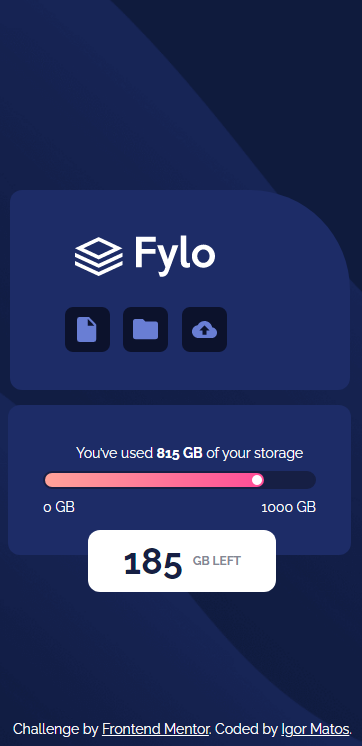
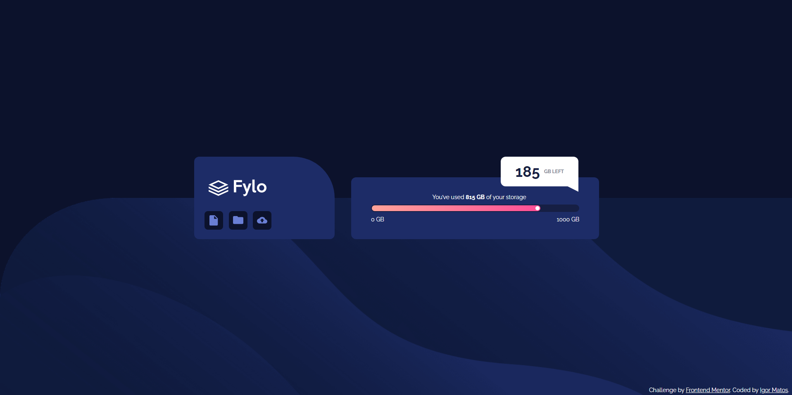

# Frontend Mentor - Fylo data storage component solution

This is a solution to the [Fylo data storage component challenge on Frontend Mentor](https://www.frontendmentor.io/challenges/fylo-data-storage-component-1dZPRbV5n). Frontend Mentor challenges help you improve your coding skills by building realistic projects. 

## Table of contents

- [Overview](#overview)
  - [The challenge](#the-challenge)
  - [Screenshot](#screenshot)
  - [Links](#links)
- [My process](#my-process)
  - [Built with](#built-with)
  - [What I learned](#what-i-learned)
  - [Continued development](#continued-development)
  - [Useful resources](#useful-resources)
- [Author](#author)
- [Acknowledgments](#acknowledgments)

## Overview

### The challenge

Users should be able to:

- View the optimal layout for the site depending on their device's screen size

### Screenshot




### Links

- Solution URL: [https://github.com/IgorWMatos/frontend_mentor03](https://github.com/IgorWMatos/frontend_mentor03)
- Live Site URL: [Add live site URL here](https://your-live-site-url.com)

## My process

### Built with

- Semantic HTML5 markup
- CSS custom properties
- SCSS
- Flexbox

### What I learned


```
```css
I've learned how to code a progress bar and create another object using ":after" to modify a 
```

### Continued development

I'd like to continue developing myself in CSS and its possibilities with intention of creating even more simplified versions of high-skilled coding.

## Author

- Website - [Igor Matos](https://github.com/IgorWMatos/frontend_mentor03)
- Frontend Mentor - [@IgorWMatos](https://www.frontendmentor.io/profile/IgorWMatos)


## Acknowledgments

You do not need to create a div for each image in need of a background. It is possible to achieve the same result with a:
img {
  bg-color: "color";
  padding: "value";
}

this will automatically add a bg-color to all of your icons.